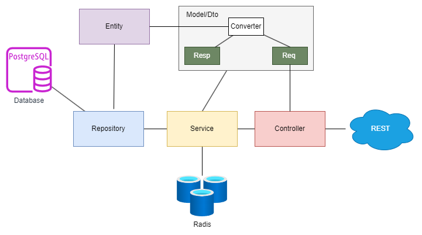

# RESTful API Architecture

This README provides an overview of the RESTful API architecture for the project. It describes the directory structure, its components, and their roles within the application.

## Table of Contents

1. [Project Structure](#project-structure)
2. [Directory Breakdown](#directory-breakdown)
   - [cmd](#cmd)
   - [internal](#internal)
     - [config](#config)
     - [controller](#controller)
     - [entity](#entity)
     - [middleware](#middleware)
     - [model](#model)
       - [converter](#converter)
       - [request](#request)
       - [response](#response)
     - [repository](#repository)
     - [server](#server)
       - [routes](#routes)
     - [services](#services)
3. [Getting Started](#getting-started)

## Architecture



## Directory Breakdown

### Explanation

- **cmd**: This directory contains the entry points for the application. In this case, it holds the `api` subdirectory that initializes and starts the API server.
- **internal**: Contains all the core logic of the application.
  - **config**: Configuration files for the application, including environment variable settings.
  - **controller**: Logic for handling HTTP requests.
    - **utils**: Utility functions that can be shared across different controllers.
  - **entity**: This directory contains definitions for the core business entities of the application, encapsulating their properties and behaviors.
  - **middleware**: Middleware functions for processing requests and responses globally.
  - **model**: Application data models and their corresponding logic.
    - **converter**: Functions for converting data between different formats.
    - **request**: DTOs (Data Transfer Objects) for incoming requests, including validation rules.
    - **response**: DTOs (Data Transfer Objects) for outgoing responses, ensuring consistent formatting.
  - **repository**: Abstraction layer for data access, enabling interactions with the database.
  - **server**: Setting up and configuring the API server.
    - **routes**: Definitions of API routes, mapping HTTP methods and paths to appropriate controller actions.
  - **services**: Business logic that may be reused across different controllers.

Here's a revised **Getting Started** section for your README that follows a clearer structure and provides detailed instructions on setting up your Go application:

---

## Getting Started

To get started with the project, follow these steps:

### Prerequisites

Before you begin, ensure you have the following installed on your system:

- Go (version 1.16 or higher)
- PostgreSQL (or your preferred database)
- Redis (using Redis for session management)

### Step 1: Clone the Repository

Clone the repository to your local machine using the following command:

```bash
git clone <url:repository>
```

### Step 2: Navigate to the Project Directory

Change your current directory to the cloned project:

```bash
cd <yourrepository>
```

### Step 3: Create a `.env` File

Create a `.env` file in the root directory of the project to define your environment variables. Here is a sample structure for the `.env` file:

```plaintext
    #  Server Conf
    PORT=
    APP_ENV=

    # Postgresql
    DB_HOST=
    DB_PORT=
    DB_DATABASE=
    DB_USERNAME=
    DB_PASSWORD=
    DB_SCHEMA=

    # Redis
    REDIS_ADDR=
    REDIS_PASSWORD=
    REDIS_DB=
```

Make sure to replace the placeholder values with your actual configuration.

### Step 4: Install Dependencies

Run the following command to install the required Go dependencies:

```bash
go mod tidy
```

### Step 5: Run the Application

You can run the application by executing the following command:

```bash
go run cmd/api/main.go
```

Or

```bash
air
```

### Step 5: Run Docker Compose

Run the following command to install the required Go dependencies:

```bash
docker-compose up --build
```

### Step 6: Run the Application

You can run the application by executing the following command:

```bash
go run cmd/api/main.go
```

Or

```bash
air
```

This will start the API server on the specified port defined in your `.env` file.

### Step 7: Access the API

Once the server is running, you can access the API endpoints using a tool like [Postman](https://www.postman.com/) or your web browser. For example:

- **Health Check**: `GET http://localhost:8080/api/v1/db/health`
- **User Registration**: `POST http://localhost:8080/api/v1/users/register`
